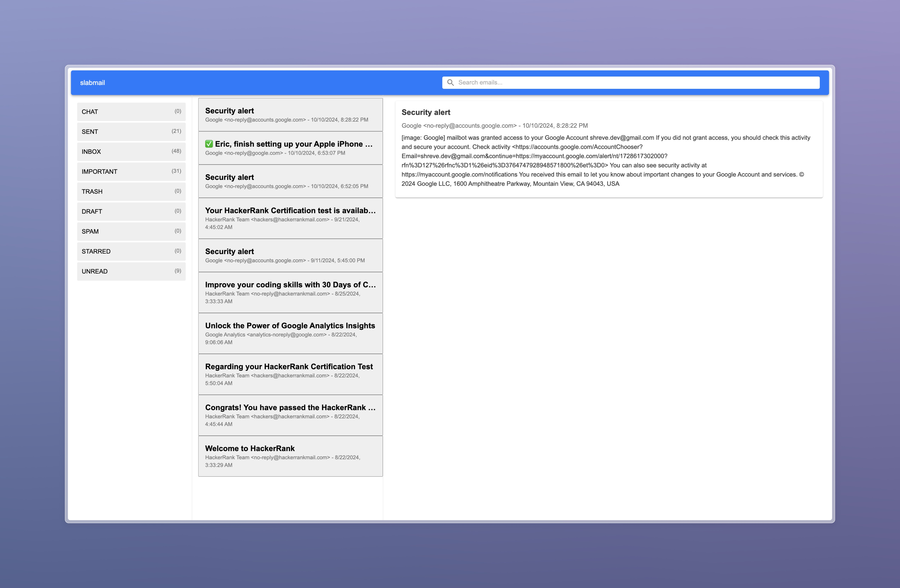

# tatemprep



## Features
- [x] Fetch emails from Gmail
- [x] Display emails in a list
- [x] Display labels in a sidebar
- [x] Display email content
- [ ] Search emails
- [ ] Filter emails
- [ ] Archive/unarchive emails

[!NOTE] This depends on a Google Cloud project with the Gmail API enabled and the necessary credentials.

## Usage

### With `run`

This project uses [run](https://github.com/amonks/run) to manage the dev environment. The `tasks.toml` file contains tasks for running the server and client separately, as well as running both in parallel in watch mode.

```
run dev
```

### Without `run`

Run the server
```bash
cd server
npm install
npx ts-node server.ts
```

Run the client
```bash
cd client
npm install
npm start
```

Access the app at http://localhost:3001

## Project Structure

### `/server`

The backend is a simple Node.js server that uses the Gmail API to fetch emails.

#### Directory Structure

```bash
/server
├── /routes       # api routes
├── /services     # api services
├── auth.ts       # gmail api auth
├── server.ts     # server entry point
└── package.json
```

### `/client`

The frontend is a React app that displays a list of emails fetched from the server.

#### Directory Structure

```bash
/client
├── /public # static files
├── /src
│   ├── /components  # dumb presentational components
│   ├── /contexts    # contexts for state management
│   ├── /hooks       # custom hooks
│   ├── /pages       # pages/routes
│   ├── /services    # api clients
│   ├── /styles      # global styles
│   ├── /types       # typescript types
│   ├── /utils       # misc utilities
│   └── App.tsx      # main app component
└── package.json
```

### `/config`

Miscellaneous configuration files, such as the Gmail API credentials which are gitignored.