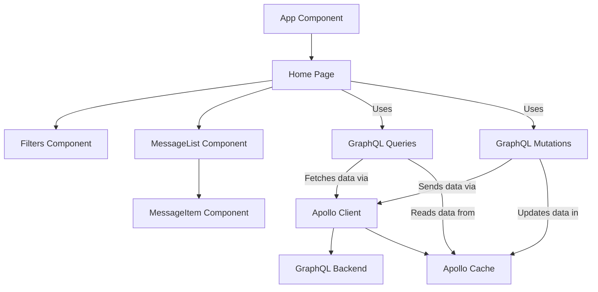
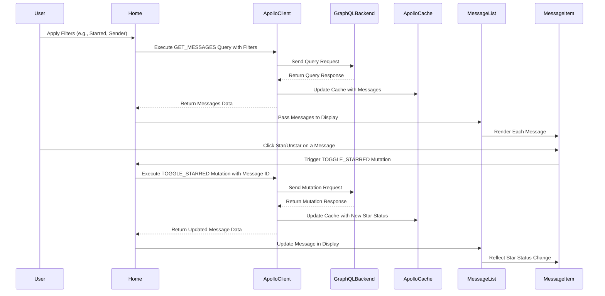
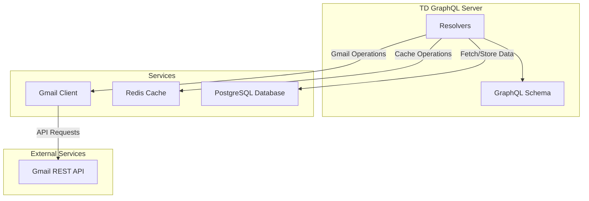
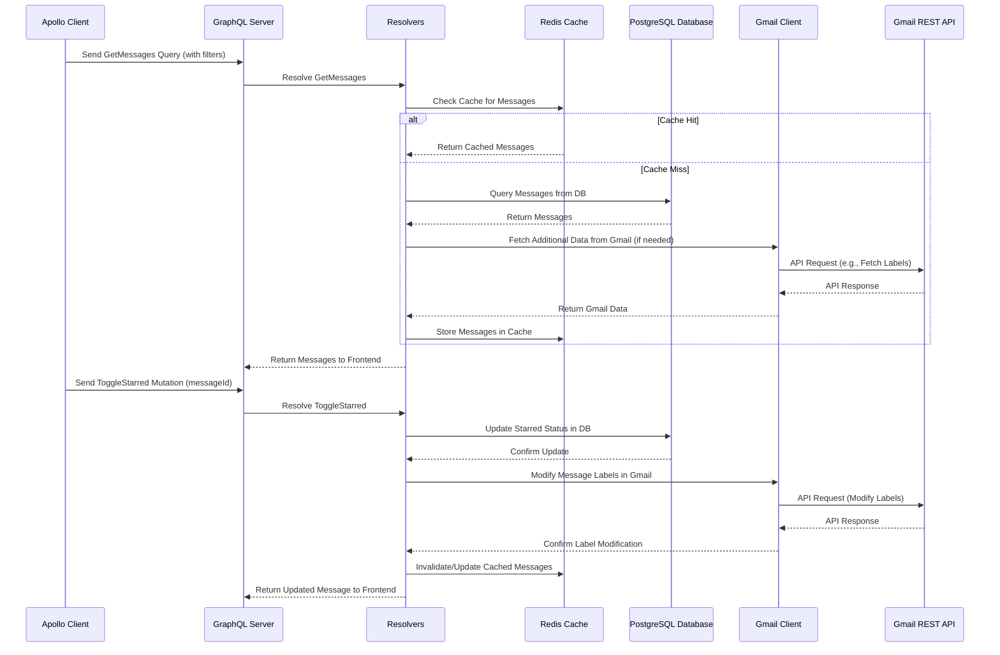

# smail

### Frontend

The frontend is a React application that uses Apollo Client to interact with the GraphQL backend. It's built with TypeScript and React.

### Overview

### Planned frontend data flow

### Backend Services

The backend is a GraphQL server implemented in Go. It uses a resolver to fetch data from a Redis cache and a PostgreSQL database. Also handles interactions with the Gmail API.

### Overview

### Backend data flow

---

