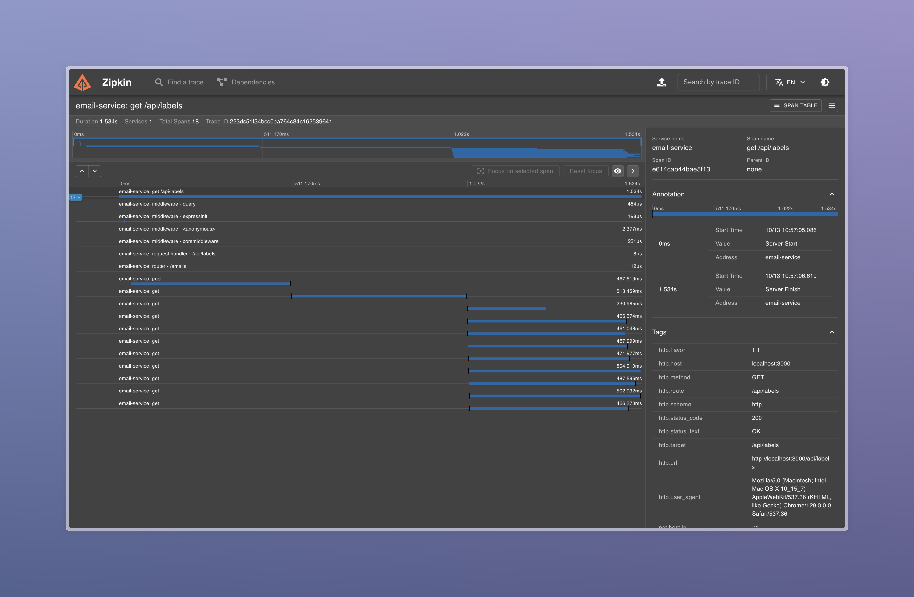

# slabmail


## Features
- [x] Fetch emails from Gmail
- [x] Display emails in a list
- [x] Display labels in a sidebar
- [x] Display email content
- [x] Star/unstar emails
- [x] Backend tracing with zipkin
- [ ] Search emails
- [ ] Filter emails

> [!NOTE] 
> This depends on a Google Cloud project with the Gmail API enabled and the necessary credentials.

## Usage

### With `run`

This project uses [run](https://github.com/amonks/run) to manage the dev environment. The `tasks.toml` file contains tasks for running the dev environment.

```
run dev
```

### Without `run`

Run zipkin and set the `EXPORTER` environment variable to `zipkin` to enable tracing.
```bash
docker compose up -d zipkin
export EXPORTER=zipkin
```

Run the server
```bash
cd server
npm install
npx ts-node src/server.ts
```

Run the client
```bash
cd client
npm install
npm start
```

Access the app at http://localhost:3001

## Project Structure

### `/server`

The backend is a simple Node.js server that uses the Gmail API to fetch emails.

#### Directory Structure

```bash
/server
├── /src
│   ├── /routes       # api routes
│   ├── /services     # api services
│   ├── auth.ts       # gmail api auth
│   ├── server.ts     # server entry point
│   ├── otel.ts       # opentelemetry setup
├── tasks.toml        # run tasks
```

### `/client`

The frontend is a React app that displays a list of emails fetched from the server.

#### Directory Structure

```bash
/client
├── /public # static files
├── /src
│   ├── /components  # dumb presentational components
│   ├── /contexts    # contexts for state management
│   ├── /hooks       # custom hooks
│   ├── /pages       # pages/routes
│   ├── /services    # api clients
│   ├── /styles      # global styles
│   ├── /types       # typescript types
│   ├── /utils       # misc utilities
│   └── App.tsx      # main app component
└── package.json
```

### `/config`

Miscellaneous configuration files, such as the Gmail API credentials which are gitignored.

### `/docker-compose.yml`

A docker compose file for running supporting services (zipkin).

## Observability

### Backend

Uses [OpenTelemetry](https://opentelemetry.io/) for tracing. The `server/src/otel.ts` file contains the setup for the tracer. The data is sent to a [zipkin](https://zipkin.io/) instance running on `localhost:9411`.



